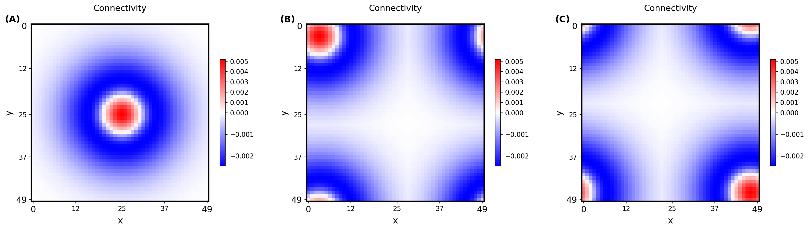
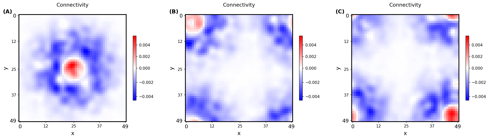
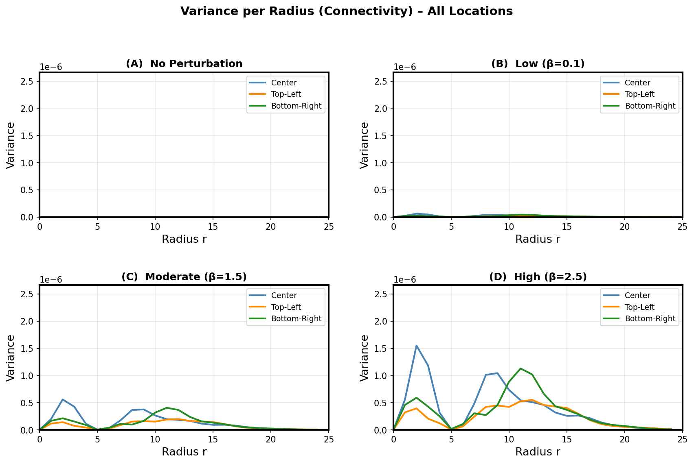
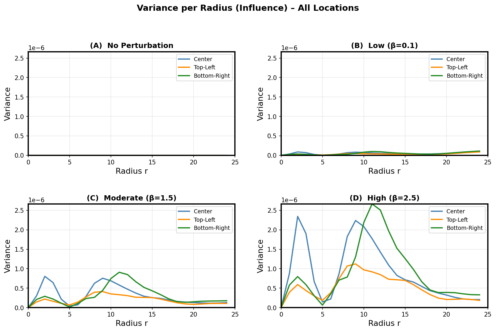
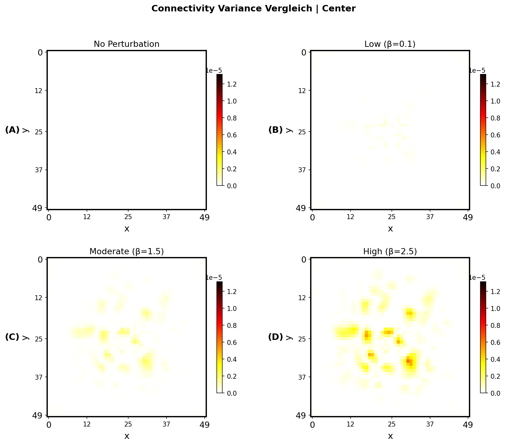
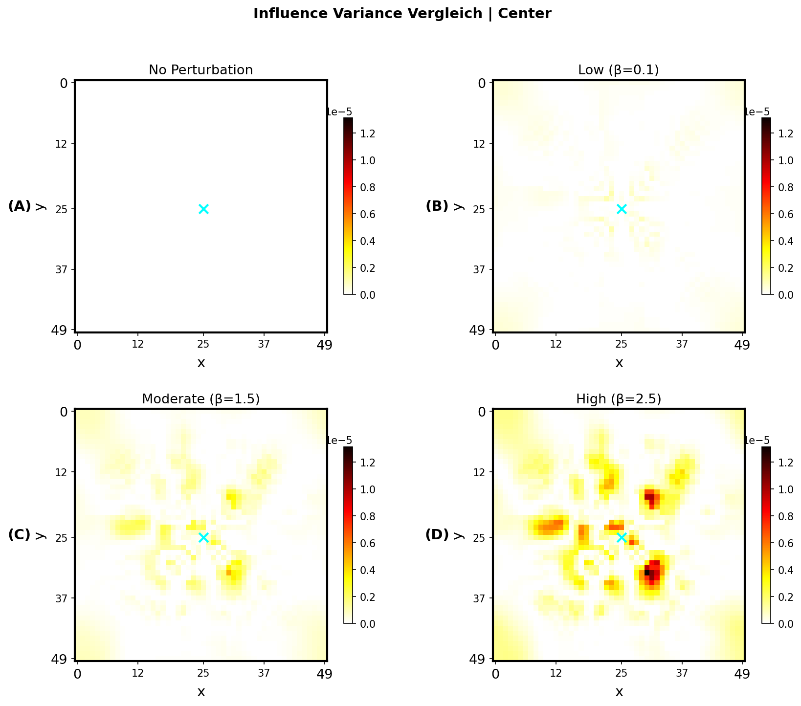

# Spatial Influence Maps & Variance Analysis

Modeling how local perturbations propagate in recurrent neural networks and how variance reveals hidden connectivity structures.

## Overview

This project investigates how functional influence propagates through recurrent neural networks and how variance patterns can reveal underlying connectivity structures.

Most existing work focuses on *mean influence*. This project analyzes the spatial variance of influence and connect it to structural heterogeneity in the network.

The core idea: Variance of influence acts as an amplifier of structural noise, providing insights into hidden network properties.

## Key Contributions

- Implemented 1D and 2D recurrent rate models
- Built spatial influence maps from perturbations
- Introduced variance mapping framework in 2D
- Modeled heterogeneity using:
  - Sparse perturbations
  - Gaussian Random Fields (GRF)
- Demonstrated that:
  - Influence variance > connectivity variance  
  - Variance hotspots match connectivity structure  
  - Recurrent dynamics amplify noise patterns  

## Tech Stack

- Python (NumPy, SciPy, Matplotlib)
- Linear algebra & spectral methods
- Fourier-based Gaussian random fields
- Computational neuroscience modeling

## Example Results

### Connectivity Kernel: Homogeneous vs. Heterogeneous

---

### Variance per Radius: Connectivity & Influence

---

### Variance Map of Connectivity and Influence: Comparison of different strengths

